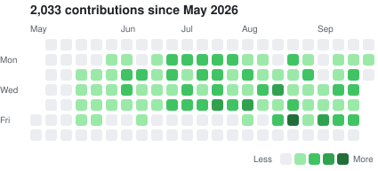

# Hi, I'm Jose 👋

📍 **Miami, FL** | **Agentic AI & Platform Engineer @ [Zensah](https://www.zensah.com)**

- 🎓 M.S. in Data Science and AI | Florida International University | May 2026 – Present
- 🎓 B.A. in Computer Science, Dean's List | Florida International University | 2022 – 2025

## 💼 Experience

**[Zensah](https://www.zensah.com)** — Agentic AI & Platform Engineer | Aug 2026 – Present\
Building AI agents and the internal data platform they run on.\
`Python` `TypeScript` `Claude API` `Multi-Agent Systems` `Next.js`

**[Zensah](https://www.zensah.com)** — Agentic AI & Platform Engineering Intern | May 2026 – Aug 2026\
Shipped autonomous AI agents to production and the platform behind them.\
`Python` `TypeScript` `Claude API` `Multi-Agent Systems`

**[Kontaktsource](https://kontaktsource.com)** — Full-Stack Developer Intern | Jun 2025 – Aug 2025\
Modernized the web platform's frontend.\
`JavaScript` `Tailwind CSS` `WordPress`

## 📈 Work Contributions ([@Jose-Zensah](https://github.com/Jose-Zensah))

<picture>
  <source media="(prefers-color-scheme: dark)" srcset="assets/contributions-dark.svg">
  
</picture>

## 🧰 Tech Stack

**Languages:**

**AI & Agents:**

**Backend & Data:**

**Frontend:**

**DevOps:**

## Connect

